# Node.js 기초

## 목차

1. [Node.js란?](#1-nodejs란)
2. [Node.js 설치](#2-nodejs-설치)
3. [Node.js 사용하기](#3-nodejs-사용하기)
4. [Node.js 모듈 시스템 이해하기](#4-nodejs-모듈-시스템-이해하기)
5. [Node.js 라이브러리 사용하기](#5-nodejs-라이브러리-사용하기)

<br>

---

<br>

# 1. Node.js란?

## 갑자기 왜 Node.js를 배워야 하는가?

- **React.js**라는 기술은 **Node.js를 기반으로 동작**하기 때문
- Node.js에 대한 기본 이해 없이는 React와 같은 기술을 제대로 이해하기 어렵다

### Node.js 기반의 주요 기술들

- **React.js**, **Next.js**, **Vue.js**, **Svelte.js** 등

<br><br>

## Node.js란?

- **웹 브라우저가 아닌 환경에서도 JavaScript 코드를 실행**시켜주는 **JavaScript 실행 환경(Run Time)**
- **실행 환경(Run Time)** = 언어를 실행하기 위한 구동기
  - 예: 게임기(게임 구동), Java Virtual Machine(Java 실행)

<br><br>

## Node.js가 필요한 이유

### JavaScript 히스토리

- 초기 JavaScript: 웹페이지 내 단순 기능 구현에 사용
  - 예: 버튼 클릭 시 경고창, 요소 색상 변경
- **한정된 웹 브라우저 환경**
  - 웹 브라우저 내에서만 동작할 수 있도록 개발 되었기 때문에 생산성에만 중심을 두고 언어가 설계됨
- c언어, Java와 달리 문법이 유연하고 작성하기 편리함
- JavaScript의 유연성에 매료된 개발자들: 웹 브라우저 외부에서도 활용하고자 함 <br>
  => **Node.js의 등장**

<br>

### Node.js가 등장한 후

- JavaScript를 어디서든 동작할 수 있는 **범용 언어**로 확장시킴
- Node.js를 이용해서 JavaScript로 많은 것들을 만들어 내기 시작함:

  - 기존에 Java, C, C# 같은 언어로 만들던 웹 서버는 JavaScript로 구축되는 일이 많아짐
  - 더 나아가 모바일 앱, 데스크탑 앱까지 만들기 시작함
  - **웹 서버**: 넷플릭스, 에어비앤비, 등...
  - **모바일 앱**: 페이스북, 인스타그램, 등...
  - **데스크톱 앱**: 슬랙, 디스코드, 등...

<br>

---

<br>

# 2. Node.js 설치

## Node.js 설치 방법

### 1. Node.js 설치

#### - Node.js 설치 파일 다운

- [Node.js 공식 사이트](https://nodejs.org/)에 접속

  - 구글에 `node.js` 검색해서 공식사이트 접속
    <figure>
      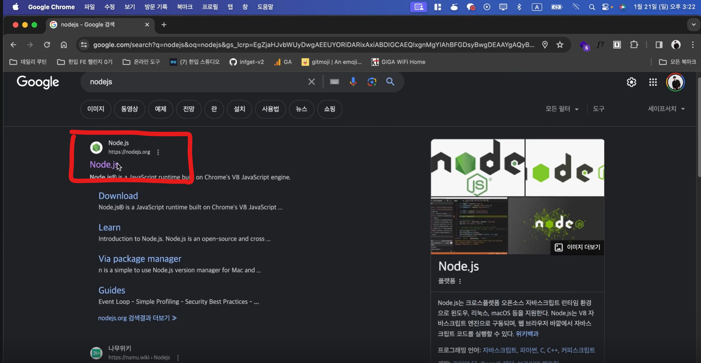
      <figcaption>출처 : 한입 크기로 잘라 먹는 리액트</figcaption>
    </figure>

- **LTS 버전**의 초록색 버튼 클릭해서 설치 파일 다운
  <figure>
      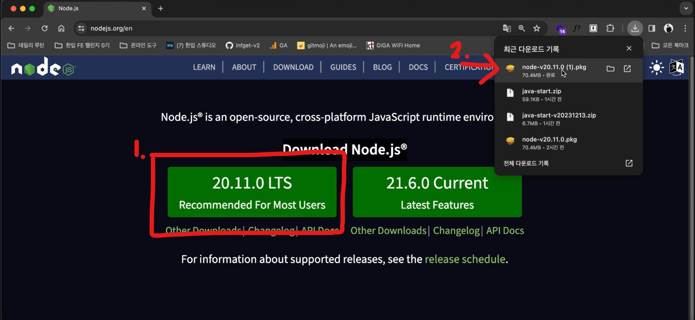
      <figcaption>출처 : 한입 크기로 잘라 먹는 리액트</figcaption>
  </figure>

  - **Current** 버전 : 가장 최신 버전
  - **LTS(Long Term Support)**: 대부분 유저들에게 추천하는 현재 가장 안정적인 버전

- 다운 받은 설치 파일 실행

<br><br>

#### - Mac OS

- 별도로 할 것 없이 일반적인 프로그램 설치하듯이 계속 버튼을 눌러서 설치 완료하면 됨
  <figure>
    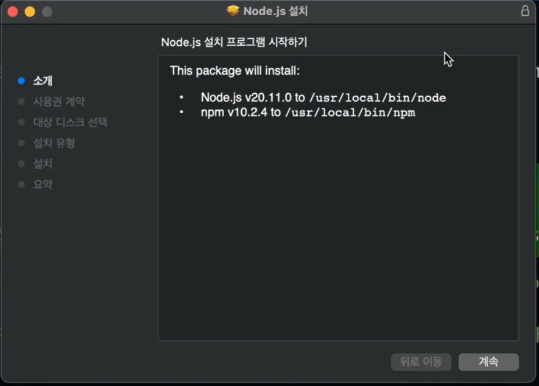
    <figcaption>출처 : 한입 크기로 잘라 먹는 리액트</figcaption>
  </figure>

<br>

#### - Window

- 설치 시작 화면
  <figure>
    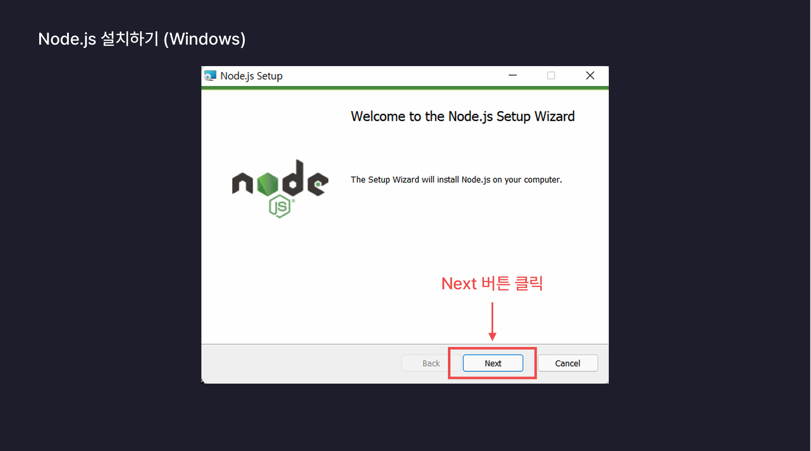
    <figcaption>출처 : 한입 크기로 잘라 먹는 리액트</figcaption>
  </figure>

- 라이센스 약관 동의 화면
  <figure>
    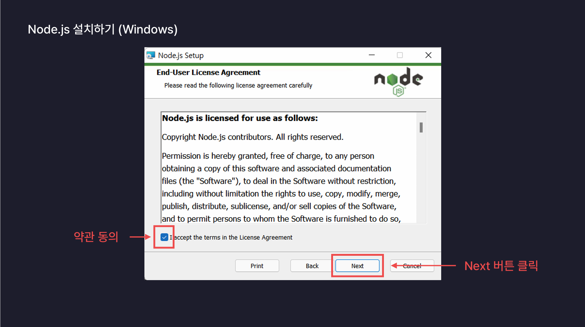
    <figcaption>출처 : 한입 크기로 잘라 먹는 리액트</figcaption>
  </figure>

- Node.js가 컴퓨터에 어떠한 경로에 설치될지 결정하는 화면

  - 웬만하면 경로 수정하지 않고 기본값으로 그대로 두는 편이 좋음
  <figure>
    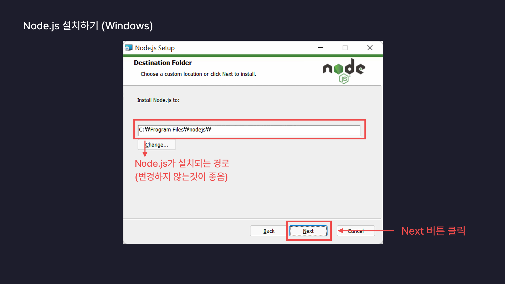
    <figcaption>출처 : 한입 크기로 잘라 먹는 리액트</figcaption>
  </figure>

- Custom Setup 화면

  - 별도로 커스텀 할 것이 없으니 그냥 넘어감
  <figure>
    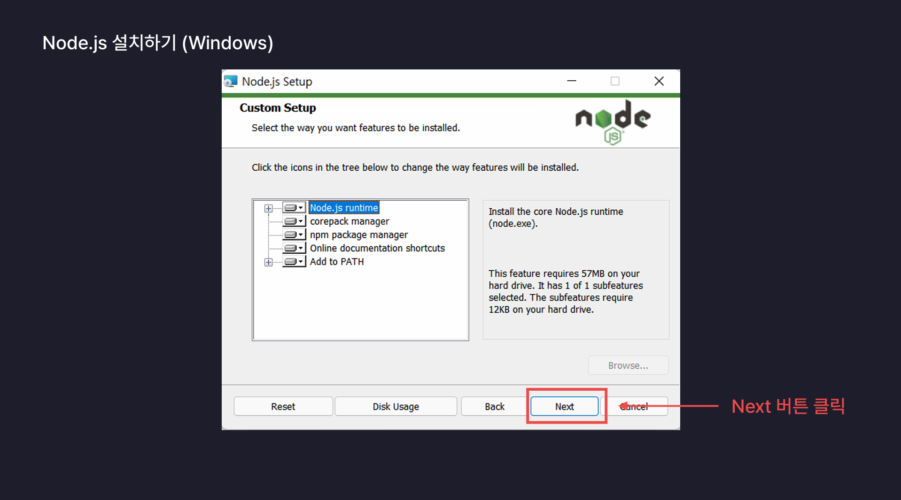
    <figcaption>출처 : 한입 크기로 잘라 먹는 리액트</figcaption>
  </figure>

- 필요한 도구를 자동으로 설치해주는 옵션 화면 (체크하기!)
  <figure>
    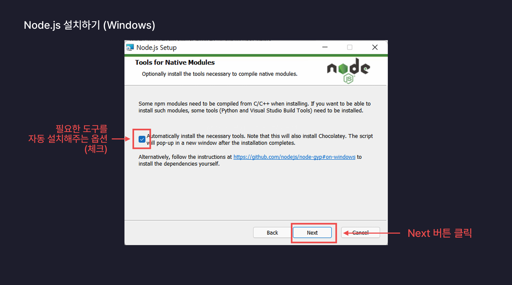
    <figcaption>출처 : 한입 크기로 잘라 먹는 리액트</figcaption>
  </figure>

- Ready to Intall 화면 (설치 준비 완료)
  <figure>
    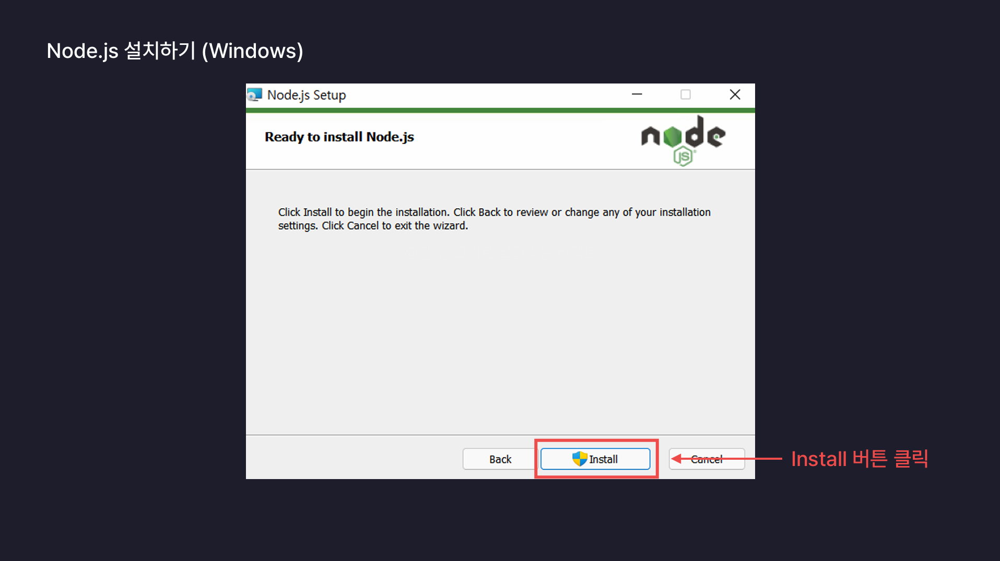
    <figcaption>출처 : 한입 크기로 잘라 먹는 리액트</figcaption>
  </figure>

- 설치 중
  <figure>
    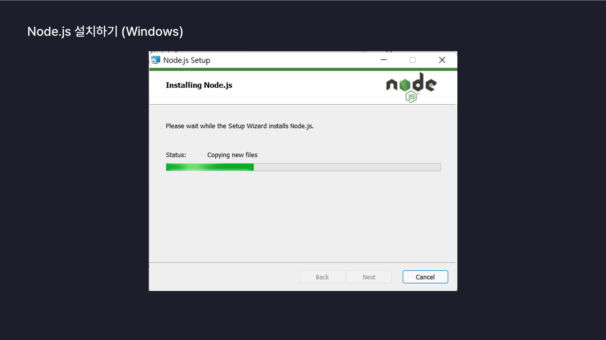
    <figcaption>출처 : 한입 크기로 잘라 먹는 리액트</figcaption>
  </figure>

- 설치 완료 후 finish 버튼 클릭
  <figure>
    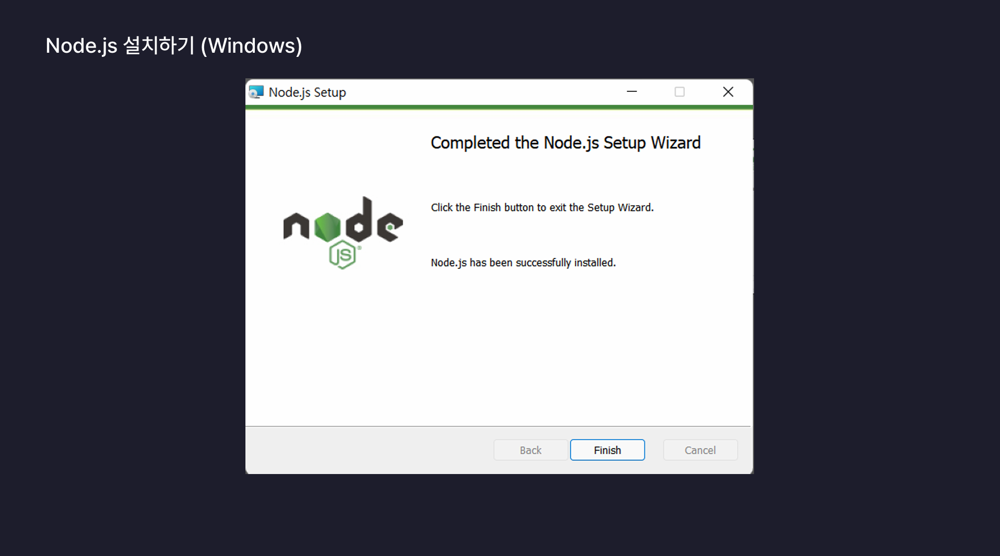
    <figcaption>출처 : 한입 크기로 잘라 먹는 리액트</figcaption>
  </figure>

<br><br>

### 2. Node.js 설치 확인

- 설치 후, **터미널**(Mac) 또는 **명령 프롬프트**(Windows)를 열고 다음 명령어 입력:

  ```bash
  node -v
  ```

- 출력 예:

  ```bash
  v20.15.1
  ```

- 예시
  <figure>
    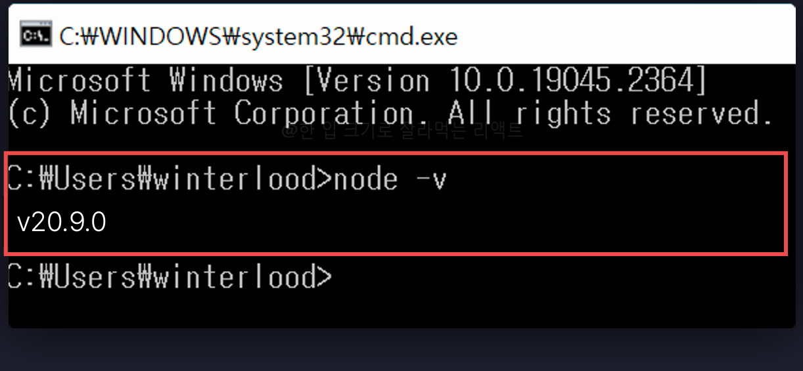
    <figcaption>출처 : 한입 크기로 잘라 먹는 리액트</figcaption>
  </figure>

  > \* 버전은 설치하는 시기에 따라 다를 수 있다
  >
  > - 맨 앞에 있는 버전이 **20점 대 이상의 짝수 버전**이라면 상관 없음 (⭕)
  > - **홀수 버전** 또는 **20버전 보다 낮은 버전**은 문제가 발생할 수 있음 (❌) <br>
  >   ==> 설치된 Node.js를 제거 한 후 다시 처음부터 설치 과정 진행

- 참고) cmd 창 여는 법
  <figure>
    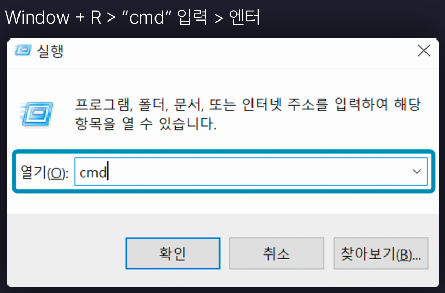
    <figcaption>출처 : 한입 크기로 잘라 먹는 리액트</figcaption>
  </figure>

<br><br>

### 3. NPM(Node Package Manager) 설치 확인

#### - 터미널 또는 명령프롬프트에서 npm 버전 확인하는 명령어 `npm -v` 입력 후 엔터

- Node.js 설치 시 NPM도 함께 설치됨
- **NPM** : Node.js의 프로젝트 단위인 패키지를 관리하는 도구

  - 새로운 패키지 생성, 외부 라이브러리 설치 또는 삭제 등 유용한 기능들을 제공

- **터미널**(Mac) 또는 **명령 프롬프트**(Windows)를 열고 다음 명령어 입력하여 버전 확인:

  ```bash
  npm -v
  ```

- 출력 예 :

  ```bash
  10.7.0
  ```

- 예시
  <figure>
    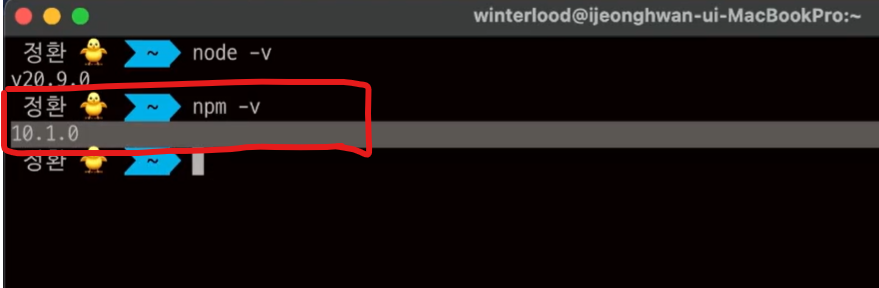
    <figcaption>출처 : 한입 크기로 잘라 먹는 리액트</figcaption>
  </figure>

  > \* npm 버전이 잘 출력되지 않는 경우
  >
  > - node 설치 과정에서 문제가 발생했을 가능성이 가장 크니까 node 제거 후 다시 설치해야 함

<br><br>

### +) 설치 후 테스트

Node.js가 제대로 설치되었는지 확인하기 위해 간단한 코드 실행 :

1. 터미널 또는 명령프롬프트에서 다음 명령어로 Node.js 실행 :

```bash
node
```

2. 아래 코드를 입력하고 실행 :

```javascript
console.log("Hello, Node.js!");
```

3. 출력 예 :

```plaintext
Hello, Node.js!
```

4. 종료하려면 `Ctrl + C`를 두 번 입력

5. 예시 :
<figure>
  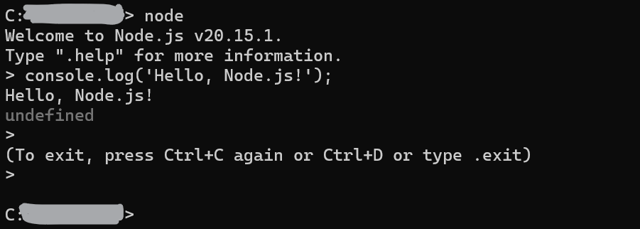
  <figcaption>출처 : 내 cmd 창</figcaption>
</figure>

<br>

---

<br>

# 3. Node.js 사용하기

<br>

---

<br>

# 4. Node.js 모듈 시스템 이해하기

<br>

---

<br>

# 5. Node.js 라이브러리 사용하기

<br>

---

<br>
