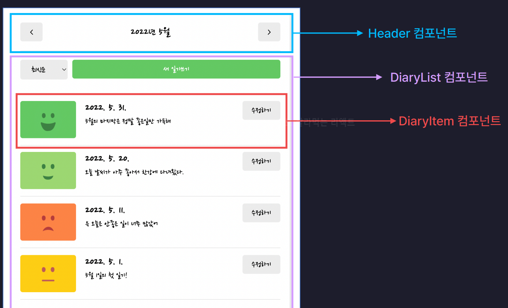

# Home 페이지(`/`) 구현

## 목차

1. [UI 구성](#1-ui-구성)
   - Home 페이지 구조
   - UI 구현 중 배운 점
2. [기능 구현](#2-기능-구현)
   - 날짜 이동
   - 월별 필터링
   - 정렬 필터링
   - 페이지 이동
   - 회고
3. [전체 코드 구조](#3-전체-코드-구조)

<br>

---

<br>

# 1. UI 구성

## Home 페이지(`/`) 구조

<figure>
   
   <figcaption>출처 : 한입 크기로 잘라 먹는 리액트</figcaption>
</figure>

### - Home 컴포넌트

- `Header` : 공통 컴포넌트, 날짜 이동 및 제목 표시
- `DiaryList` : 정렬 필터 및 일기 리스트 렌더링


### - DiaryList 컴포넌트

- 상단부 : 메뉴바(정렬 필터, 새일기 추가 버튼)
- 하단부 : 반복적으로 렌더링된 `DiaryItem` 컴포넌트


### - DiaryItem 컴포넌트

- 왼쪽 섹션 : 감정 이미지
- 중앙 섹션 : 작성 날짜와 내용
- 오른쪽 섹션 : 수정 버튼


### - 컴포넌트 간 관계

```plaintext
Home
 ├── Header
 └── DiaryList
      └── DiaryItem
```

## UI 구현 중 배운 점

### - HTML

- 각 영역의 역할에 맞는 `className` 부여 --> 유지보수성 향상
- `option` 태그의 `value`값을 영어로 설정 --> 코드 관리가 쉬움
  ```jsx
  <option value="latest">최신순</option>
  <option value="oldest">오래된 순</option>
  ```

### - CSS 팁

- `flex: 1` : 부모 컨테이너의 여유 공간을 모두 차지
- `gap` : 자식 요소 간의 간격 조절 (grid와 flexbox에서 사용 가능)

<br>

---

<br>

# 2. 기능 구현

## \* 날짜 이동
버튼 클릭시 날짜가 한 달씩 이동하고 그 날짜를 실시간으로 화면에 렌더링

#### Header 컴포넌트

- **기준 날짜(`pivotDate`) state로 관리**

  ```jsx
  const [pivotDate, setPivotDate] = useState(new Date());
  ```

- **날짜 이동 이벤트 핸들러** (`onIncreaseMonth`, `onDecreaseMonth`)

  ```jsx
  const onIncreaseMonth = () => {
    setPivotDate(new Date(pivotDate.getFullYear(), pivotDate.getMonth() + 1));
  };

  const onDecreaseMonth = () => {
    setPivotDate(new Date(pivotDate.getFullYear(), pivotDate.getMonth() - 1));
  };
  ```

- **Header 컴포넌트의 props 로 `pivotDate`, `onIncreaseMonth`, `onDecreaseMonth` 전달**
  ```jsx
  <Header
    title={`${pivotDate.getFullYear()}년 ${pivotDate.getMonth() + 1}월`}
    leftChild={<Button onClick={onDecreaseMonth} text={"<"} />}
    rightChild={<Button onClick={onIncreaseMonth} text={">"} />}
  />
  ```

<br>

> 주의 : `getMonth()`는 0부터 시작하므로 렌더링 시 `+1` 필요

<br><br>

## \* 월별 필터링

### Home 컴포넌트

- **`DiaryStateContext`로 부터 일기 데이터가 담긴 `data` state 공급 받기**

  ```jsx
  // 상단에 useContext, DiaryStateContext import 하기

  const data = useContext(DiaryStateContext);
  ```

- **`getMonthlyData` 함수** : 월별 필터링 기능

  ```jsx
  // Home 컴포넌트 바깥
  const getMonthlyData = (pivotDate, data) => { // 매개변수 : 기준 날짜인 pivotDate, 일기 데이터가 담긴 data
    const beginTime = new Date(
      pivotDate.getFullYear(),
      pivotDate.getMonth(),
      1, // 1일
      0, // 0시
      0, // 0분
      0 // 0초
    ).getTime(); // 타임스탬프 형태

    const endTime = new Date(
      pivotDate.getFullYear(),
      pivotDate.getMonth() + 1,
      0, // 이전 달의 마지막 날로 설정됨
      23, // 23시
      59, // 59분
      59 // 59초
    ).getTime();

    return data.filter(
      (item) => beginTime <= item.createdDate && item.createdDate <= endTime
    );
  };
  ```

  > Date 객체의 일을 0으로 설정하면 이전 달의 마지막 날로 설정된다!

- **변수 `monthlyData`안에 월별로 필터링 된 데이터를 담고 `DiaryList`의 `data` props로 전달**
  ```jsx
  // Home 컴포넌트 내부
  const mothlyData = getMonthlyData(pivotData, data);
  ```
  ```jsx
  <DiaryList data={mothlyData} />
  ```

<br><br>

## \* 정렬 필터링

#### DiaryList 컴포넌트

- **정렬 옵션을 의미하는 `sortType`(가변 데이터)를 state로 관리**
  ```jsx
  const [sortType, setSortType] = useState("latest");
  ```
- ` onChangeSortType` **함수 생성** : `<select>`의 `value` 값이 바뀌면 해당 값으로 setSortType 하도록 하기 위해 `onChange `이벤트 핸들러로 설정

  ```jsx
  const onChangeSortType = (e) => {
    setSortType(e.target.value);
  };
  ```

<br>

- `getSortedData` **함수 생성** : `sortType` 바뀔 때마다 일기 데이터를 정렬하는 기능

  ```jsx
  const getSortedData = () => {
    return data.toSorted((a, b) => {
      if (sortType === "oldest") {
        // 혹시 모를 오류 방지 위해 Number타입으로 강제 형변환
        return Number(a.createdDate) - Number(b.createdDate);
      } else {
        return Number(b.createdDate) - Number(a.createdDate);
      }
    }); // 새로운 배열 반환 (원본데이터 유지)
  };

  // 삼항 연산자 이용
  /*
  const getSortedData = () =>
    data.toSorted((a, b) =>
      sortType === "latest"
        ? Number(b.createdDate) - Number(a.createdDate)
        : Number(a.createdDate) -  Number(b.createdDate)
  );
  */
  ```

  > **toSorted vs sort**
  >
  > - `toSorted` --> 정렬된 새로운 배열 반환, 원본 배열 유지
  > - `sort` --> 어떠한 값도 반환 X, 그냥 원본 배열 정렬

<br>

- **리렌더링 될때마다 `sortedData`라는 변수에 `getSortedData` 함수를 호출한 결과 저장**

  ```jsx
  const sortedData = getSortedData();
  ```

- **렌더링**
  ```jsx
  <div className="list_wrapper">
    {sortedData.map((item) => (
      <DiaryItem key={item.id} {...item} />
    ))}
  </div>
  ```
  > 리액트에서는 리스트 형태로 어떤 컴포넌트나 UI를 렌더링 할 때
  > 각각의 **모든 아이템**에 고유한 **키값을 반드시 설정**해줘야함

<br><br>

## \* 페이지 이동

#### DiaryItem, DiaryList 컴포넌트

- **React Router의 `Navigation` 함수 이용**
- **DiaryItem.jsx**

  ```jsx
  import { useNavigate } from "react-router-dom";

  const DiaryItem = ({ id, emotionId, createdDate, content }) => {
    // 페이지 이동 시키는 navigate 함수 변수 nav에 저장
    const nav = useNavigate();

    // 왼쪽, 가운데 섹션 클릭 : 일기 상세조회 페이지로 이동
    // 수정 버튼 클릭 : 수정 페이지로 이동

    return (
      <div className="DiaryItem">
        <div
          onClick={() => nav(`/diary/${id}`)}
          className={`img_section img_section_${emotionId}`}
        >
          
        </div>
        <div onClick={() => nav(`/diary/${id}`)} className="info_section">
          <div className="created_date">
            {new Date(createdDate).toLocaleDateString()}
          </div>
          <div className="content">{content}</div>
        </div>
        <div className="button_section">
          <Button onClick={() => nav(`/edit/${id}`)} text={"수정하기"} />
        </div>
      </div>
    );
  };
  ```

<br><br>

## 회고

#### - 데이터 상태 관리

- **`data` state를 App 컴포넌트에 배치한 이유**
  - `data`는 모든 페이지에서 접근 가능한 전역 데이터로 사용해야 함
  - App 컴포넌트가 모든 페이지 컴포넌트의 부모 역할을 하므로, 최상위 컴포넌트인 App에 `data` state를 선언

#### - Context 사용 이유

- **Props 대신 Context를 사용한 이유**
  - Props를 사용하면 중간 컴포넌트들이 데이터를 전달하기 위한 역할만 하게 되어 **Props Drilling** 문제가 발생
  - Context를 이용해 데이터를 전역으로 관리함으로써 **직접 접근 가능**하도록 설계하여 효율성을 높임

#### - getMonthlyData 함수 위치

- **컴포넌트 외부에 선언한 이유**
  - **매개변수 기반 설계**: 함수가 필요한 데이터를 매개변수로 모두 전달받을 수 있음.
  - **가독성**: 함수 내부가 좀 길고 복잡해 컴포넌트 내부에 선언하면 코드 가독성이 떨어짐.
  - **성능**: 함수 내부에 선언 시, 컴포넌트가 리렌더링 될 때마다 함수가 새로 생성됨. 이를 방지하기 위해 외부로 분리.

#### - 추가 팁

- 함수가 **매개변수만으로 필요한 데이터를 모두 받을 수 있는 경우**, 컴포넌트 외부에 선언해도 문제 없음.
  - 외부 선언으로 **컴포넌트 내부의 복잡도**를 줄이고, 코드의 **재사용성과 유지보수성**을 높일 수 있음.

<br>

---

<br>

# 3. 전체 코드 구조

- **Home.jsx**

  ```jsx
  import { useState, useContext } from "react";
  import { DiaryStateContext } from "../App";

  import Header from "../components/Header";
  import Button from "../components/Button";
  import DiaryList from "../components/DiaryList";

  // 월별 필터링
  const getMonthlyData = (pivotDate, data) => {
    const beginTime = new Date(
      pivotDate.getFullYear(),
      pivotDate.getMonth(),
      1,
      0,
      0,
      0
    ).getTime();

    const endTime = new Date(
      pivotDate.getFullYear(),
      pivotDate.getMonth() + 1,
      0, // 이번달의 마지막날로 설정하고 싶으면 다음달의 0일로 설정한다
      23,
      59,
      59
    ).getTime();

    return data.filter(
      (item) => beginTime <= item.createdDate && item.createdDate <= endTime
    );
  };

  const Home = () => {
    // context로 데이터 공급 받기
    const data = useContext(DiaryStateContext);

    // pivot : 기준
    const [pivotDate, setPivotDate] = useState(new Date());

    // 날짜별 필터링 된 일기 데이터
    const monthlyData = getMonthlyData(pivotDate, data);

    // 날짜 이동
    const onIncreaseMonth = () => {
      setPivotDate(new Date(pivotDate.getFullYear(), pivotDate.getMonth() + 1));
    };

    const onDecreaseMonth = () => {
      setPivotDate(new Date(pivotDate.getFullYear(), pivotDate.getMonth() - 1));
    };

    return (
      <div>
        <Header
          title={`${pivotDate.getFullYear()}년 ${pivotDate.getMonth() + 1}월`}
          leftChild={<Button onClick={onDecreaseMonth} text={"<"} />}
          rightChild={<Button onClick={onIncreaseMonth} text={">"} />}
        />
        <DiaryList data={monthlyData} />
      </div>
    );
  };

  export default Home;
  ```

<br>

- **DiaryList.jsx**

  ```jsx
  import "./DiaryList.css";
  import Button from "./Button";
  import DiaryItem from "./DiaryItem";
  import { useNavigate } from "react-router-dom";
  import { useState } from "react";

  const DiaryList = ({ data }) => { // Home 컴포넌트에서 props로 월별 필터링 된 mothlyData 전달 받음

    // 페이지 이동 시키는 navigate 함수 변수 nav에 저장
    const nav = useNavigate();

    const [sortType, setSortType] = useState("latest"); // 정렬 옵션 state

    // select 태그의 onChange 이벤트 핸들러
    const onChangeSortType = (e) => {
      setSortType(e.target.value);
    };

    // 정렬 기능
    const getSortedData = () => {
      return data.toSorted((a, b) => {
        if (sortType === "oldest") {
          return Number(a.createdDate) - Number(b.createdDate);
        } else {
          return Number(b.createdDate) - Number(a.createdDate);
        }
      }); // 새로운 배열 반환 (원본데이터 유지)
    };

    const sortedData = getSortedData(); // 정렬된 일기 데이터

    return (
      <div className="DiaryList">
        <div className="menu_bar">
          <select onChange={onChangeSortType}>
            <option value={"latest"}>최신순</option>
            <option value={"oldest"}>오래된 순</option>
          </select>
          <Button
            onClick={() => nav("/new")}
            text={"새 일기 쓰기"}
            type={"POSITIVE"}
          />
        </div>
        <div className="list_wrapper">
          {sortedData.map((item) => (
            <DiaryItem key={item.id} {...item} />
          ))}
        </div>
      </div>
    );
  };

  export default DiaryList;
  ```

  <br>

- **DiaryItem.jsx**

  ```jsx
  import "./DiaryItem.css";
  // 감정이미지 불러오는 함수
  import { getEmotionImage } from "../util/get-emotion-image";
  import Button from "./Button";
  import { useNavigate } from "react-router-dom";

  const DiaryItem = ({ id, emotionId, createdDate, content }) => { // DiaryList에서 props로 전달 받은 데이터 객체 구조 분해 할당으로 받아옴
    const nav = useNavigate(); // 페이지 이동 시키는 navigate 함수 변수 nav에 저장

    return (
      <div className="DiaryItem">
        <div
          onClick={() => nav(`/diary/${id}`)}
          className={`img_section img_section_${emotionId}`}
        >
          
        </div>
        <div onClick={() => nav(`/diary/${id}`)} className="info_section">
          <div className="created_date">
            {new Date(createdDate).toLocaleDateString()}
          </div>
          <div className="content">{content}</div>
        </div>
        <div className="button_section">
          <Button onClick={() => nav(`/edit/${id}`)} text={"수정하기"} />
        </div>
      </div>
    );
  };

  export default DiaryItem;
  ```
