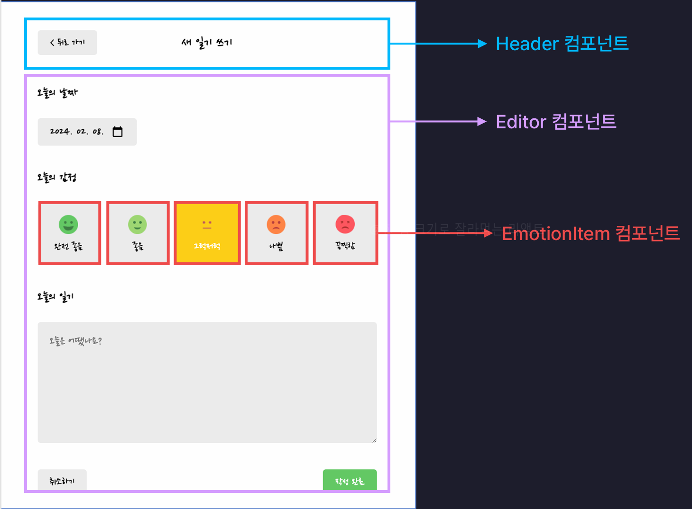

# New 페이지(`/new`) 구현

사용자로부터 **새로운 일기**를 입력받아 **추가**하는 기능을 가진 페이지

## 목차

1. [UI 구성](#1-ui-구성)
   - New 페이지 구조
   - UI 구현 중 배운 점
2. [기능 구현](#2-기능-구현)
   - Header
   - 일기 작성 폼
       1) [state 관리](#1-사용자가-입력한-모든-데이터를-하나의-state로-관리)
       2) [날짜 선택](#2-날짜-선택)
       3) [감정 선택](#3-감정-선택)
       4) [일기 내용](#4-일기-내용)
       5) [작성 완료 버튼](#5-작성-완료-버튼)
       6) [작성 취소 버튼](#6-작성-취소-버튼)
   - [참고 (다른 방식의 코드)](#참고---다른-방식의-코드코드-개선)
3. [전체 코드 구조](#3-전체-코드-구조)

<br>

---

<br>

# 1. UI 구성

## New 페이지(`/new`) 구조

<figure>
   
   <figcaption>출처 : 한입 크기로 잘라 먹는 리액트</figcaption>
</figure>

### - New 컴포넌트

- `Header` : 공통 컴포넌트, 제목과 뒤로가기 버튼
- `Editor` : 사용자로부터 새로운 일기 입력받음

### - Editor 컴포넌트

- 날짜입력 section : 날짜 선택
- 감정입력 section : 감정 선택,`emotionItem` 컴포넌트 반복 렌더링
- 내용 section : 일기 내용 작성
- 버튼 section : 작성 취소 버튼, 작성 완료 버튼

### - EmotionItem 컴포넌트

- 상단부 : 감정 이미지
- 하단부 : 감정 이름

### - 컴포넌트 간 관계

```plaintext
New
 ├── Header
 └── Editor
      └── EmotionItem
```

## UI 구현 중 배운 점

### - 반복되는 컴포넌트 처리

- **잘못된 방식** : 반복되는 컴포넌트를 일일히 배치하고 각 컴포넌트에 props도 일일히 작성해서 전달하는 방식

  ```jsx
  <EmtionItem emotionId={1} emotionName={"완전 좋음"}/>
  <EmtionItem emotionId={2} emotionName={"좋음"}/>
  <EmtionItem emotionId={3} emotionName={"그럭 저럭"}/>
  <EmtionItem emotionId={4} emotionName={"나쁨"}/>
  <EmtionItem emotionId={5} emotionName={"끔찍함"}/>
  ```

  - 이런 방식은 **유지보수에 불편**을 초래함
    - props에 변경사항이 생길 경우, 중복된 코드 모두 수정해야 함
    - 비효율적이며 가독성이 떨어짐

- **개선된 방식: 데이터 배열과 `map` 메서드 활용**

  - **컴포넌트 외부** : 배열로 데이터 정의
    ```jsx
    const emotionList = [
      { emotionId: 1, emotionName: "완전 좋음" },
      { emotionId: 2, emotionName: "좋음" },
      { emotionId: 3, emotionName: "그럭저럭" },
      { emotionId: 4, emotionName: "나쁨" },
      { emotionId: 5, emotionName: "끔찍함" },
    ];
    ```
  - **컴포넌트 내부**: `map` 메소드를 이용해 리스트 렌더링

    ```jsx
    <div className="emotion_list_wrapper">
      {emotionList.map((item) => (
        <EmotionItem key={item.emotionId} {...item} />
      ))}
    </div>
    ```

  - **장점** :
    - 데이터 수정 시, **배열 데이터만 관리**하면 됨
    - props 변경 시, `map`메소드 내부 코드만 수정하면 됨
    - 반복적인 코드 작성 X, 효율적으로 UI 렌더링 가능

### - HTML

- **`<div>`와 `<section>`의 차이**
  - `<div>`와 `<section>`의 기능은 동일
  - 차이점 : **의미적인 태그**로의 사용 여부
    - `section` 태그는 코드 가독성을 높이고, 구조를 더 명확히 표현하는 데 적합

### - CSS

- **`resize` 속성**
  - 특정 방향으로만 요소 크기 조정이 가능하도록 제한할 수 있음
    ```css
    resize: vertical; /* 가로로는 크기 조정 불가, 세로로만 가능 */
    ```
- **`box-sizing` 속성**
  - 요소의 크기를 계산할 때, **padding**과 **border**를 포함하여 계산하도록 설정 가능
  - 이 설정을 통해 요소가 화면 바깥으로 튀어나가는 문제를 방지할 수 있음
    ```css
    box-sizing: border-box;
    ```
- **body 태그에 flex 스타일 적용**
  - `index.css`에서 `body` 태그에 `display: flex` 속성을 추가하면, 페이지 전체를 감싸는 **플렉스 컨테이너**로 설정할 수 있음
    ```css
    body {
      display: flex;
    }
    ```

<br>

---

<br>

# 2. 기능 구현

## \* Header

- **뒤로 가기**

  - `useNavigate`를 사용해 `navigate` 함수의 인수로 `-1` 전달
  - **New.jsx**

    ```jsx
    import { useNavigate } from "react-router-dom";

    const New = () => {
      const nav = useNavigate();

      return (
        <div>
          <Header
            title={"새 일기 쓰기"}
            leftChild={<Button onClick={() => nav(-1)} text={"< 뒤로 가기"} />}
          />
        </div>
      );
    };
    ```
<br><br>

## \* 일기 작성 폼(Editor 컴포넌트)

### (1) 사용자가 입력한 모든 데이터를 하나의 State로 관리

- State를 객체 형태로 관리하면 하나의 state에 여러 개의 값을 관리할 수 있음
- **State 구조** : `createdDate`, `emotionId`, `content`를 하나의 객체로 관리
- **`onChangeInput` 핸들러**: state의 값들을 입력한 값으로 동적으로 업데이트(일단 기본틀 작성)

  ```jsx
  const [input, setInput] = useState({
    createdDate: new Date(),
    emotionId: 3,
    content: "",
  });

  const onChangeInput = (e) => {
    let name = e.target.name; // 어떤 요소에 입력이 들어온 건지 (요소의 name 값)
    let value = e.target.value; // 입력된 값이 무엇인지 (요소의 value 값)

    setInput({
      ...input, // 기존의 state 값 유지
      [name]: value,
    });
  };
  ```
<br>

> 어떤 요소인지 구분할 수 있도록 각 입력 요소에 name 속성 부여해야함!

<br><br>

### (2) 날짜 선택

- 날짜 객체를 문자열로 변환하는 `getStringedDate` 함수 작성

  ```jsx
  const getStringedDate = (targetDate) => {
    // 날짜 -> YYYY-MM-DD
    let year = targetDate.getFullYear();
    let month = targetDate.getMonth() + 1;
    let date = targetDate.getDate();

    // 월, 일이 9 이하일 땐 "MM-DD"형식에 맞게 앞에 0 붙여줌
    if (month < 10) {
      month = `0${month}`;
    }

    if (date < 10) {
      date = `0${date}`;
    }

    return `${year}-${month}-${date}`;
  };
  ```

  > #### 날짜 객체를 문자열로 변환하는 이유 :
  >
  > - 현재 `input.createdDate`는 Date 객체
  > - `<input type="date">`는 value속성으로 Date객체로 설정된 값을 넣으면 이해를 못함 <br>
  >   ==> `input` 요소에 날짜가 잘 렌더링 되지 않는 문제 발생
  >   <br><br>
  >   따라서, Date객체를 문자열로 변환해서 `value`의 속성에 넣어줘야함!

<br>

- `<input type="date">`의 초기값 설정 및 사용자 입력 시 입력값으로 업데이트 처리

  - `input.createdDate`는 Date 객체, `<input>`의 `value`값은 문자열이므로 변경된 요소의 `name`이 `createDate`일때 `value`값을 다시 Date객체로 변경해주는 코드 추가
  - `onChangeInput` 함수 :

    ```jsx
    const onChangeInput = (e) => {
      let name = e.target.name;
      let value = e.target.value;

      if (name === "createdDate") {
        value = new Date(value); // 문자열값을 날짜객체로 변경
      }

      setInput({
        ...input,
        [name]: value,
      });
    };
    ```

  - `<input type="date" name="createdDate">` 요소 :

    ```jsx
    <input
      name="createdDate"
      value={getStringedDate(input.createdDate)}
      onChange={onChangeInput}
      type="date"
    />
    ```

<br><br>

### (3) 감정 선택

- **특징** : 감정 선택은 `<input>`이나 `<select>` 같은 입력 요소가 아니라, EmotionItem 컴포넌트를 클릭하는 방식으로 입력 처리
- **구현 방법** :

  - `EmotionItem` 컴포넌트 클릭 시 감정이 선택된 것처럼 작동하게 하기 위해, `onChangeInput` 함수를 호출하여 **이벤트를 직접 발생시킴**
  - onClick 이벤트를 통해 입력된 값을 `onChangeInput`에 전달.

- **`EmotionItem` 컴포넌트 클릭 이벤트 구현**

  - 클릭 시 발생해야 할 이벤트를 `onClick` props로 전달
  - **Editor.jsx**
    ```jsx
    <div className="emotion_list_wrapper">
      {emotionList.map((item) => (
        <EmotionItem
          onClick={() =>
            onChangeInput({
              target: {
                name: "emotionId",
                value: item.emotionId,
              },
            })
          }
          key={item.emotionId}
          {...item}
        />
      ))}
    </div>
    ```
    > - **작동 원리** :
    > - `onChangeInput`은 실제 입력 요소가 아닌, `EmotionItem`이 클릭되었을 때 실행됨
    > - `onClick`에서 직접 이벤트 객체 형태로 데이터를 만들어 전달 <br>
    >   예 : `{ target: { name: "emotionId", value: item.emotionId } }`

<br>

- **`EmotionItem`의 클릭 이벤트 처리**

  - `onClick`으로 전달된 함수가 호출되도록 `EmotionItem`의 클릭 이벤트에 연결
  - **EmotionItem.jsx** :
    ```jsx
    const EmotionItem = ({ emotionId, emotionName, onClick }) => (
      <div onClick={onClick} className="EmotionItem">
        
        <div className="emotion_name">{emotionName}</div>
      </div>
    );
    ```
    > - **중요** : `onClick`을 설정하지 않으면 클릭 시 아무 동작도 하지 않음
    > - `onClick`에서 전달된 함수는 `Editor` 컴포넌트의 `onChangeInput`을 호출

<br>

- **감정 선택 하이라이팅**

  - **`EmotionItem` 컴포넌트에 선택 여부 전달**

    - `Editor` 컴포넌트에서 각 `EmotionItem` 컴포넌트를 렌더링하며,
      선택된 감정(`input.emotionId`)과 해당 요소의 id(`item.emotionId`)를 비교하여 `isSelected` 값을 `EmotionItem`에 전달.

      ```jsx
      // Editor.jsx
      <section className="emotion_section">
        <h4>오늘의 감정</h4>
        <div className="emotion_list_wrapper">
          {emotionList.map((item) => (
            <EmotionItem
              onClick={() =>
                onChangeInput({
                  target: {
                    name: "emotionId",
                    value: item.emotionId,
                  },
                })
              }
              key={item.emotionId}
              {...item}
              isSelected={item.emotionId === input.emotionId}
            />
          ))}
        </div>
      </section>
      ```
<br>

  - **`EmotionItem`에 동적 클래스 네임 적용**

    - `EmotionItem` 컴포넌트에서 `isSelected` 값이 `true`인 경우, 동적으로 클래스명를 추가
    - 각 감정마다 고유한 배경색을 적용하기 위해 `emotionId` 사용
    - EmotionItem.jsx

      ```jsx
      const EmotionItem = ({ emotionId, emotionName, isSelected, onClick }) => {
        return (
          <div
            onClick={onClick}
            className={`EmotionItem ${
              isSelected ? `EmotionItem_on_${emotionId}` : ""
            }`} // 동적 클래스 네임(번호마다 배경색이 달라서 emotionId도 붙임)
          >
            
            <div className="emotion_name">{emotionName}</div>
          </div>
        );
      };
      ```

    - `isSelected`에 따라 동적으로 추가된 클래스별로 고유 배경색 지정
    - EmotionItem.css

      ```css
      /* ...EmotionItem의 공통 스타일 생략 */

      .EmotionItem_on_1 {
        background-color: rgb(100, 201, 100);
      }
      .EmotionItem_on_2 {
        background-color: rgb(157, 215, 114);
      }
      /* ...나머지 스타일 */
      ```

<br><br>

### (4) 일기 내용

- 사용자 입력 값을 `input.content`에 저장
- Editor.jsx
  ```jsx
  <section className="content_section">
    <h4>오늘의 일기</h4>
    <textarea
      name="content"
      value={input.content}
      onChange={onChangeInput}
      placeholder="오늘은 어땠나요?"
    />
  </section>
  ```

<br><br>

### (5) 작성 완료 버튼

- 작성 완료 버튼 클릭 시, 새 일기를 App 컴포넌트의 `data` state에 추가 후 Home 페이지로 이동 <br>
  (단, 뒤로 가기를 누를 때 다시 작성하기 페이지로 돌아가지 않도록 방지)

- **주의 사항**

  - `Editor` 컴포넌트는 **New 페이지**와 **Edit 페이지**에서 **공통으로 사용**됨
  - 버튼 동작이 페이지에 따라 달라짐 :
    - **New 페이지** : 새로운 일기 추가
    - **Edit 페이지** : 기존 일기 수정
  - 따라서, `Editor.jsx`에서 직접 `DiaryDispatchContext`의 `onCreate`를 호출하면 **Edit 페이지에서의 수정 동작을 구현하기 어렵다**

- **해결 방법**

  - 작성 완료 버튼 클릭 시 실행할 함수를 **props로 전달 받도록 설정**
  - 각 페이지에서 컨텍스트로부터 필요한 동작(`onCreate`, `onUpdate` 등)을 공급받아 props로 전달하여 버튼 클릭 시 호출

- **코드 구현**

#### New.jsx

- `Editor` 컴포넌트에 새로운 일기를 추가하는 함수를 전달(`DiaryDispatchContext`로부터 `onCreate` 함수 공급 받음)
- 작성 완료 후 **홈 페이지로 이동**하면서 **뒤로 가기 방지 옵션**(`replace: true`) 설정.

  ```jsx
  import { useContext } from "react";
  import { DiaryDispatchContext } from "../App";
  import { useNavigate } from "react-router-dom";

  const New = () => {
    const { onCreate } = useContext(DiaryDispatchContext);
    const nav = useNavigate();

    const onSubmit = (input) => {
      onCreate(
        input.createdDate.getTime(), // 타임스탬프 형식으로 저장
        input.emotionId,
        input.content
      );
      nav("/", { replace: true }); // 뒤로 가기 방지하며 홈으로 이동
    };

    return (
      <div>
        <Editor onSubmit={onSubmit} />
      </div>
    );
  };
  ```

#### Editor.jsx

- 작성 완료 버튼 클릭 시 props로 전달받은 `onSubmit` 호출 : `onClickSubmitButton` 함수 작성

  ```jsx
  const Editor = ({ onSubmit }) => {
    const [input, setInput] = useState({
      createdDate: new Date(),
      emotionId: 3,
      content: "",
    });

    const onClickSubmitButton = () => {
      onSubmit(input); // 부모에서 전달받은 함수 실행
    };

    return (
      <section className="button_section">
        <Button onClick={() => nav(-1)} text="취소하기" />
        <Button onClick={onClickSubmitButton} text="작성완료" type="POSITIVE" />
      </section>
    );
  };
  ```

<br><br>

### (6) 작성 취소 버튼

- 클릭시 Home 페이지로 이동(뒤로 가기)

  ```jsx
  import { useNavigate } from "react-router-dom";

  const Editor = ({ onSubmit }) => {
    const nav = useNavigate();

    return (
      <section className="button_section">
        <Button onClick={() => nav(-1)} text={"취소하기"} />
      </section>
    );
  };
  ```

<br>

> ### 주의! : 일기 데이터는 데이터 베이스나 서버에 저장하고 있지 않기 때문에 <br>
>
> ### 새로고침 되면 state로 보관한 일기는 사라지고 mockData로 설정한 초기 데이터만 남는다!

<br>

## 참고 - 다른 방식의 코드(코드 개선)

#### - `onChangeInput` 함수에 객체 구조 분해 할당과 삼항 연산자 이용 :

```jsx
const onChangeInput = (e) => {
  const { name, value } = e.target;
  setInput({
    ...input,
    [name]: name === "createdDate" ? new Date(value) : value,
  });
};
```

<br><br>

#### - `getStringedDate` 함수에 `String()`와 `padStart()` 메소드 이용 :

```jsx
const getStringedDate = (date) => {
  const year = date.getFullYear();
  const month = String(date.getMonth() + 1).padStart(2, "0");
  const day = String(date.getDate()).padStart(2, "0");
  return `${year}-${month}-${day}`;
};
```

- `padStart()` : **문자열의 길이를 특정 값으로 맞추기 위해** 앞쪽에 지정된 문자로 채우는 JavaScript 문자열 메서드
   - **문법**
     ```jsx
     str.padStart(targetLength, padString);
     ```
   - **매개변수**
      1. `targetLength` (필수):
         - 목표로 하는 최종 문자열 길이.
         - 원래 문자열의 길이가 `targetLength`보다 크거나 같으면 채우지 않고 원래 문자열 그대로 반환.
      2. padString (선택):
         - 앞쪽에 채울 문자열. 기본값은 " "(공백)
         - `padString`의 길이가 `targetLength`를 넘으면 잘려서 사용됨

<br><br>

### - 동적 클래스명에 삼항연산자가 아닌 논리연산자(&&)를 사용한 방법

```jsx
className={`EmotionItem ${isSelected && `EmotionItem_on_${emotionId}`}`}
```

- **코드 동작 방식**

  - **기본 클래스** : `EmotionItem`은 항상 포함
  - **조건부 클래스 추가** : `isSelected && ...`의 결과에 따라 추가되는 클래스가 달라짐 (**단락 평가**)
    - `isSelected가 true`면, 백틱 안의 템플릿 리터럴(`${emotionId}`)이 실행
    - 결과적으로 `EmotionItem_on_${emotionId}`라는 문자열이 반환
    - `isSelected`가 `false`라면, `&&`의 오른쪽 부분이 무시되므로 아무것도 추가되지 않음

<br>

---

<br>

# 3. 전체 코드 구조

- **New.jsx**

  ```jsx
  import Header from "../components/Header";
  import Button from "../components/Button";
  import Editor from "../components/Editor";
  import { useNavigate } from "react-router-dom";
  import { useContext } from "react";
  import { DiaryDispatchContext } from "../App";

  const New = () => {
    const nav = useNavigate();
    const { onCreate } = useContext(DiaryDispatchContext);

    // 새로운 일기 추가 후 뒤로 가기
    const onSubmit = (input) => {
      onCreate(input.createdDate.getTime(), input.emotionId, input.content);
      nav("/", { replace: true });
      // replace 옵션 : 뒤로 가기를 방지하면서 페이지를 이동시키는 옵션
    };

    return (
      <div>
        <Header
          title={"새 일기 쓰기"}
          leftChild={<Button onClick={() => nav(-1)} text={"< 뒤로 가기"} />}
        />
        <Editor onSubmit={onSubmit} />
      </div>
    );
  };

  export default New;
  ```

- **Editor.jsx**

  ```jsx
  import "./Editor.css";
  import EmotionItem from "./EmotionItem";
  import Button from "./Button";
  import { useState } from "react";
  import { useNavigate } from "react-router-dom";

  const emotionList = [
    {
      emotionId: 1,
      emotionName: "완전 좋음",
    },
    {
      emotionId: 2,
      emotionName: "좋음",
    },
    {
      emotionId: 3,
      emotionName: "그럭저럭",
    },
    {
      emotionId: 4,
      emotionName: "나쁨",
    },
    {
      emotionId: 5,
      emotionName: "끔찍함",
    },
  ];

  // date객체를 문자열로 변환
  const getStringedDate = (targetDate) => {
    // 날짜 -> YYYY-MM-DD
    let year = targetDate.getFullYear();
    let month = targetDate.getMonth() + 1;
    let date = targetDate.getDate();

    if (month < 10) {
      month = `0${month}`;
    }

    if (date < 10) {
      date = `0${date}`;
    }

    return `${year}-${month}-${date}`;
  };

  // onSubmit 함수 ==> new 페이지 : onCreate(새로운 일기 생성)
  //                  edit 페이지 : onUpdate(기존 일기 수정)
  const Editor = ({ onSubmit }) => {
    const [input, setInput] = useState({
      // state를 객체 형태로 => 여러 개의 값을 하나의 state에 저장하고 관리
      createdDate: new Date(),
      emotionId: 3,
      content: "",
    });

    const nav = useNavigate();

    // onChange 이벤트 핸들러
    const onChangeInput = (e) => {
      let name = e.target.name; // 어떤 요소에 입력이 들어온건지(요소의 name속성값)
      let value = e.target.value; // 입력된 값이 무엇인지?(요소의 value값)

      if (name === "createdDate") {
        value = new Date(value); // 문자열값을 날짜객체로 변경
      }

      setInput({
        ...input, // 기존의 state값 유지
        [name]: value,
      });
    };

    const onClickSubmitButton = () => {
      onSubmit(input);
    };

    return (
      <div className="Editor">
        <section className="date_section">
          <h4>오늘의 날짜</h4>
          <input
            name="createdDate"
            onChange={onChangeInput}
            value={getStringedDate(input.createdDate)}
            type="date"
          />
        </section>
        <section className="emotion_section">
          <h4>오늘의 감정</h4>
          <div className="emotion_list_wrapper">
            {emotionList.map((item) => (
              <EmotionItem
                onClick={() =>
                  onChangeInput({
                    target: {
                      name: "emotionId",
                      value: item.emotionId,
                    },
                  })
                }
                key={item.emotionId}
                {...item}
                isSelected={item.emotionId === input.emotionId}
              />
            ))}
          </div>
        </section>
        <section className="content_section">
          <h4>오늘의 일기</h4>
          <textarea
            name="content"
            value={input.content}
            onChange={onChangeInput}
            placeholder="오늘은 어땠나요?"
          />
        </section>
        <section className="button_section">
          <Button onClick={() => nav(-1)} text={"취소하기"} />
          <Button
            onClick={onClickSubmitButton}
            text={"작성완료"}
            type={"POSITIVE"}
          />
        </section>
      </div>
    );
  };

  export default Editor;
  ```

- **Editor.css**

  ```css
  .Editor > section > input,
  textarea {
    background-color: rgb(236, 236, 236);
    border: none;
    border-radius: 5px;
    font-size: 20px;
    padding: 10px 20px;
  }

  /*emtionItem 스타일 설정*/
  .Editor .emotion_section .emotion_list_wrapper {
    display: flex;
    justify-content: space-around;
    gap: 2%;
  }

  /* 오늘의 일기 섹션의 textarea 스타일*/
  .Editor > section > textarea {
    padding: 20px;
    width: 100%;
    min-height: 200px;
    resize: vertical; /*가로로는 못늘리고 세로로만 늘릴 수 있음*/
    box-sizing: border-box; /*화면의 바깥으로 튀어나오지 않도록*/
  }

  /* 버튼 섹션 스타일*/
  .Editor .button_section {
    display: flex;
    justify-content: space-between;
  }
  ```

- **EmotionItem.jsx**

  ```jsx
  import "./EmotionItem.css";
  import { getEmotionImage } from "../util/get-emotion-image";

  const EmotionItem = ({ emotionId, emotionName, isSelected, onClick }) => {
    return (
      <div
        onClick={onClick}
        className={`EmotionItem ${
          isSelected ? `EmotionItem_on_${emotionId}` : ""
        }`}
      >
        
        <div className="emotion_name">{emotionName}</div>
      </div>
    );
  };

  export default EmotionItem;
  ```

- **EmotionItem.css**

  ```css
  .EmotionItem .emotion_img {
    width: 50%;
    margin-bottom: 10px;
  }

  /* 감정 선택 시 강조 스타일 */
  .EmotionItem_on_1 {
    color: white;
    background-color: rgb(100, 201, 100);
  }
  .EmotionItem_on_2 {
    color: white;
    background-color: rgb(157, 215, 114);
  }
  .EmotionItem_on_3 {
    color: white;
    background-color: rgb(253, 206, 23);
  }
  .EmotionItem_on_4 {
    color: white;
    background-color: rgb(253, 132, 70);
  }
  .EmotionItem_on_5 {
    color: white;
    background-color: rgb(253, 86, 95);
  }
  ```
