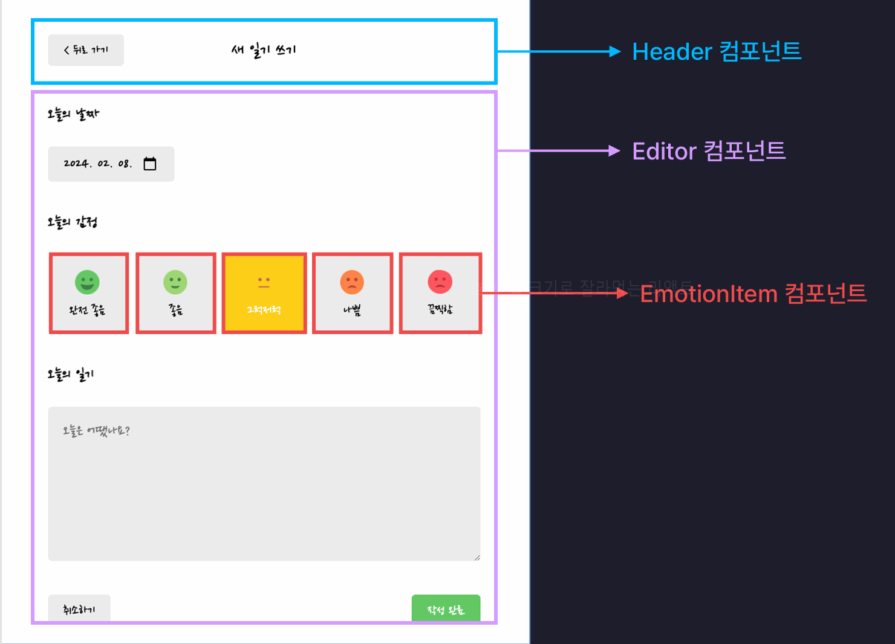

# Edit 페이지(`/edit`) 구현

## 목차

1. [UI 구성](#1-ui-구성)
   - Edit 페이지 구조
2. [기능 구현](#2-기능-구현)
   - 삭제 기능
   - 기존 데이터를 기본값으로 설정
   - 작성 완료 버튼(수정 기능)
3. [전체 코드 구조](#3-전체-코드-구조)

<br>

---

<br>

# 1. UI 구성

## Edit 페이지(`/new`) 구조

<figure>
   
   <figcaption>출처 : 한입 크기로 잘라 먹는 리액트</figcaption>
</figure>

- New 페이지와 컴포넌트의 구성이 거의 같음
- 차이점 : Header 컴포넌트의 `title`, `rightChild` 부분에 `NEGATIVE`한 버튼이 추가로 배치되어 있음

<br>

---

<br>

# 2. 기능 구현

## \* 삭제 기능

#### 기능 요구 사항 :

- 사용자가 삭제 버튼을 잘못 눌렀을 때 실수로 삭제되지 않도록 팝업창을 통해 확인을 요청
- 삭제가 완료되면 홈 화면으로 이동하며, 뒤로 가기를 눌러도 이전 페이지로 돌아오지 않도록 설정

#### 구현 코드 :

- 삭제 버튼이 클릭되었을 때 동작할 이벤트 핸들러 작성 : `onClickDelete`

  ```jsx
  import { useContext } from "react";
  import { DiaryDispatchContent } from "../App";

  const Edit = () => {
    const params = useParams();
    const nav = useNavigate();
    const { onDelete } = useContext(DiaryDispatchContext);

    const onClickDelete = () => {
      if (window.confirm("일기를 정말 삭제할까요? 다시 복구되지 않아요!")) {
        // 일기 삭제 로직
        onDelete(params.id);

        // 삭제가 끝난 후 Home 페이지로 이동 (+ 뒤로 가기 방지)
        nav("/", { replace: true });
      }
    };
  };
  ```

  - `window.confirm`: 사용자 확인 팝업창
  - 삭제가 확정되면 `DiaryDispatchContext`로부터 공급받은 `onDelete`로 삭제 로직 실행 후, `nav("/", { replace: true })`로 홈 화면으로 이동.

<br><br>

## \* 기존 데이터를 기본값으로 설정

#### 기능 요구 사항 :

- 알맞은 URL로 접근 시 기존의 데이터가 각 섹션의 기본값으로 설정되어 렌더링
- 잘못된 URL로 접근 시 알람창 띄운 후 Home 페이지로 이동

#### 기능 구현 :

### 1) 수정하려는 데이터 id값을 기준으로 가져오기:

- `DiaryStateContext`로부터 `data` state를 공급 받아 `params.id`와 일치하는 데이터를 찾으려 함
- 잘못된 URL로 접근(존재하지 않는 일기로 접근)했을 때 알람창을 띄운 후 Home 페이지로 이동시키려 할 때 **문제 발생**

- **문제**

  - 잘못된 URL로 접근했을 때 알람창만 뜨고 `navigate` 함수는 작동하지 않음
  - 문제 코드 예시: `getCurrentItem` 함수 안의 `navigate` 함수는 `Edit` 컴포넌트가 처음 호출이 되었을 때 바로 호출이 되고 있다(컴포넌트 렌더링 과정에서 호출하고 있음)

    ```jsx
    import { useContext } from "react";
    import { DiaryDispatchContent, DiaryStateContext } from "../App";

    const Edit =() => {
      const params = useParams();
      const data = useContext(DiaryStateContext); // data State 공급받음

      const getCurrentDiaryItem = () => {
        const currentDiaryItem = data.find(
          (item) => String(item.id) === String(id)
        );

        // 사용자가 존재하지 않는 일기로 진입했을 때
        if (!currentDiaryItem) {
          window.alert("존재하지 않는 일기입니다.");
          nav("/", { replace: true }); // ==> 문제 발생 : navigate 함수 동작 X
        }

        return currentDiaryItem;
      };


      const currentDiaryItem = getCurrentDiaryItem();
      return();
    }
    ```

  - 브라우저 콘솔 경고 메시지 : navigate 함수는 컴포넌트가 처음 렌더링 될 때가 아니라 useEffect 함수 안에서 호출이 되어야 한다

    ```bash
    Edit.jsx:32 You should call navigate() in a React.useEffect(), not when your component is first rendered.
    ```

    - **이유** :
      - React Router의 `navigate` 같은 기능들은 결국에 이전에 `main.jsx` 파일에 설정해놓은 `BrowserRouter`라는 컴퍼넌트가 공급하고 있는 기능이므로 `BrowserRouter` 컴포넌트가 렌더링이 되고 난 후에 `navigate` 함수 실행이 가능
      - 따라서, React Router의 `navigate` 함수는 모든 컴포넌트가 완전히 **마운트된 후에만** 실행 가능(컴포넌트가 화면에 다 렌더링 된 후)
      - 컴포넌트 렌더링 도중 호출하면 React Router가 정상적으로 작동하지 않음

<br>

> #### `onClickDelete` 함수 안에서의 `navigate` 함수 호출은 왜 가능한걸까?
>
> - `onClickDelete`는 **이벤트 핸들러**로, 브라우저 화면이 렌더링된 후 사용자 입력으로 동작
> - `getCurrentDiaryItem`은 컴포넌트 초기화 시점에 호출되므로, `navigate`가 브라우저 렌더링 이전에 호출됨

<br>

- **해결 방법**

  - **useEffect 사용**:

    - 컴포넌트가 마운트된 후 `navigate` 함수를 호출하도록 변경
    - useEffect의 콜백함수 내부는 `getCurrentDiaryItem` 함수의 코드와 유사하나 `getCurrentDiaryItem`처럼 반환하는 값을 변수에 담을 수 없으므로 State에 저장
    - 코드 :

      ```jsx
      import { useContext, useEffect, useState } from "react";
      import { DiaryDispatchContent, DiaryStateContext } from "../App";

      const Edit =() => {
        const params = useParams();
        const data = useContext(DiaryStateContext); // data State 공급받음
        // 현재의 일기 데이터를 보관할 state
        const [curDiaryItem, setCurDiaryItem] = useState(); // 초기값은 일단 빈값

        // params의 id, data State 변경, 마운트 될 때 실행(현재 일기 데이터 꺼내오기)
        useEffect(() => {
          const currentDiaryItem = data.find(
            (item) => String(item.id) === String(id)
          );

          // 사용자가 존재하지 않는 일기로 진입했을 때
          if (!currentDiaryItem) {
            window.alert("존재하지 않는 일기입니다.");
            nav("/", { replace: true });
          }

          setCurDiaryItem(currentDiaryItem); // curDiaryItem State에 보관
        }, [param.id, data]);

        return(
          //...내용 생략
        );
      }
      ```

    - **핵심 변경점**
      - `navigate` 함수 호출 시점을 **useEffect**로 조정
      - 데이터를 찾을 수 없는 경우에도 컴포넌트가 일단 렌더링이 된 후 `navigate`를 호출하므로 에러 없이 작동

<br>

### 2) Editor 컴포넌트에 기존 일기 데이터 렌더링

- `curDiaryItem` State의 값을 Editor 컴포넌트의 기본값으로 설정

- `Edit` 컴포넌트 내부의 `Editor` 컴포넌트에게 `initData`(초기값)라는 props로 `curDirayItem` State의 값 전달
  ```jsx
  <Editor initData={curDiaryItem} onSubmit={onSubmit} />
  ```
- `Edit` 페이지에서 전달받은 `initData`값이 변경될 때마다 `input` State의 초기값으로 설정

  - **useEffect** 사용
  - **주의** : `initData.createdDate`는 타임스탬프 형태이고 `input.createdDate`는 날짜 객체임!

    ```jsx
    import { useState, useEffect } from "react";

    const Editor = ({ initData, onSubmit }) => {
      const [input, setInput] = useState({
        createdDate: new Date(),
        emotionId: 3,
        content: "",
      });

      useEffect(() => {
        if (initData) {
          // initData가 실제로 존재한다면(일기 데이터를 잘 불러왔을 경우)
          setInput({
            ...initData,
            // 타임스탬프 형식인 initData.createdDate를 날짜객체로 바꿈
            createdDate: new Date(Number(initData.createdDate)), // init.createdData가 문자열일 수 있으므로 숫자타입르로 형변환
          });
        }
      }, [initData]); // initData의 값이 변경될 때마다 실행
    };
    ```

<br><br>

## \* 작성 완료 버튼(수정 기능)

#### 기능 요구 사항 :

- 수정 버튼 클릭 시 확인 팝업창을 띄우고, 사용자가 확인하면 데이터를 업데이트.
- 수정 후 홈 화면으로 이동

#### 기능 구현 :

- `Edit` 페이지에서 `onSubmit` 함수를 만든 후 `Editor` 컴퍼넌트에 props로 전달
  (자세한 내용은 6_new-page.md 참고)
- `DiaryDispatchContext`로 부터 `onUpdate` 함수를 공급 받아 `onSubmit` 내부에서 호출
- 코드 :

  ```jsx
  const { onDelete, onUpdate } = useContext(DiaryDispatchContext);

  const onSubmit = (input) => {
    if (window.confirm("일기를 정말 수정할까요?")) {
      onUpdate(
        params.id,
        input.createdDate.getTime(), // 타임스탬프 형식
        input.emotionId,
        input.content
      );
      nav("/", { replace: true });
    }
  };
  ```

<br>

---

<br>

# 3. 전체 코드 구조

- **Edit.jsx**

  ```jsx
  import { useParams, useNavigate } from "react-router-dom";
  import Header from "../components/Header";
  import Button from "../components/Button";
  import Editor from "../components/Editor";
  import { useContext, useEffect, useState } from "react";
  import { DiaryDispatchContext, DiaryStateContext } from "../App";
  import usePageTitle from "../hooks/usePageTitle";

  const Edit = () => {
    const params = useParams();

    const nav = useNavigate();

    const { onDelete, onUpdate } = useContext(DiaryDispatchContext);

    // 현재의 일기 데이터를 보관할 state
    const [curDiaryItem, setCurDiaryItem] = useState(); // 초기값은 일단 빈값

    // params의 id, data State 변경, 마운트 될 때 실행(현재 일기 데이터 꺼내오기)
    useEffect(() => {
      const currentDiaryItem = data.find(
        (item) => String(item.id) === String(id)
      );

      // 사용자가 존재하지 않는 일기로 진입했을 때
      if (!currentDiaryItem) {
        window.alert("존재하지 않는 일기입니다.");
        nav("/", { replace: true });
      }

      setCurDiaryItem(currentDiaryItem); // curDiaryItem State에 보관
    }, [param.id, data]);

    const onClickDelete = () => {
      if (window.confirm("일기를 정말 삭제할까요? 다시 복구되지 않아요!")) {
        // 일기 삭제 로직
        onDelete(params.id);
        nav("/", { replace: true });
      }
    };

    const onSubmit = (input) => {
      if (window.confirm("일기를 정말 수정할까요?")) {
        onUpdate(
          params.id,
          input.createdDate.getTime(),
          input.emotionId,
          input.content
        );
        nav("/", { replace: true });
      }
    };

    return (
      <div>
        <Header
          title={"일기 수정하기"}
          leftChild={<Button onClick={() => nav(-1)} text={"< 뒤로 가기"} />}
          rightChild={
            <Button
              onClick={onClickDelete}
              text={"삭제하기"}
              type={"NEGATIVE"}
            />
          }
        />
        <Editor initData={curDiaryItem} onSubmit={onSubmit} />
      </div>
    );
  };

  export default Edit;
  ```

- **Editor.jsx**

  ```jsx
  import "./Editor.css";
  import EmotionItem from "./EmotionItem";
  import Button from "./Button";
  import { useState, useEffect } from "react";
  import { useNavigate } from "react-router-dom";
  import { emotionList } from "../util/constants";
  import { getStringedDate } from "../util/getStringedDate";

  // date객체를 문자열로 변환
  const getStringedDate = (targetDate) => {
    // 날짜 -> YYYY-MM-DD
    let year = targetDate.getFullYear();
    let month = targetDate.getMonth() + 1;
    let date = targetDate.getDate();

    if (month < 10) {
      month = `0${month}`;
    }

    if (date < 10) {
      date = `0${date}`;
    }

    return `${year}-${month}-${date}`;
  };

  // onSubmit 함수 ==> new 페이지 : onCreate(새로운 일기 생성)
  //                  edit 페이지 : onUpdate(기존 일기 수정)
  const Editor = ({ initData, onSubmit }) => {
    const [input, setInput] = useState({
      createdDate: new Date(),
      emotionId: 3,
      content: "",
    });

    const nav = useNavigate();

    // 수정 페이지에서 렌더링 될 때 현재 일기 데이터를 기본값으로 설정
    useEffect(() => {
      if (initData) {
        setInput({
          ...initData,
          createdDate: new Date(Number(initData.createdDate)),
        });
      }
    }, [initData]);

    // onChange 이벤트 핸들러
    const onChangeInput = (e) => {
      let name = e.target.name; // 어떤 요소에 입력이 들어온건지(요소의 name속성값)
      let value = e.target.value; // 입력된 값이 무엇인지?(요소의 value값)

      if (name === "createdDate") {
        value = new Date(value); // 문자열값을 날짜객체로 변경
      }

      setInput({
        ...input, // 기존의 state값 유지
        [name]: value,
      });
    };

    const onClickSubmitButton = () => {
      onSubmit(input);
    };

    return (
      <div className="Editor">
        <section className="date_section">
          <h4>오늘의 날짜</h4>
          <input
            name="createdDate"
            onChange={onChangeInput}
            value={getStringedDate(input.createdDate)}
            type="date"
          />
        </section>
        <section className="emotion_section">
          <h4>오늘의 감정</h4>
          <div className="emotion_list_wrapper">
            {emotionList.map((item) => (
              <EmotionItem
                onClick={() =>
                  onChangeInput({
                    target: {
                      name: "emotionId",
                      value: item.emotionId,
                    },
                  })
                }
                key={item.emotionId}
                {...item}
                isSelected={item.emotionId === input.emotionId}
              />
            ))}
          </div>
        </section>
        <section className="content_section">
          <h4>오늘의 일기</h4>
          <textarea
            name="content"
            value={input.content}
            onChange={onChangeInput}
            placeholder="오늘은 어땠나요?"
          />
        </section>
        <section className="button_section">
          <Button onClick={() => nav(-1)} text={"취소하기"} />
          <Button
            onClick={onClickSubmitButton}
            text={"작성완료"}
            type={"POSITIVE"}
          />
        </section>
      </div>
    );
  };

  export default Editor;
  ```
