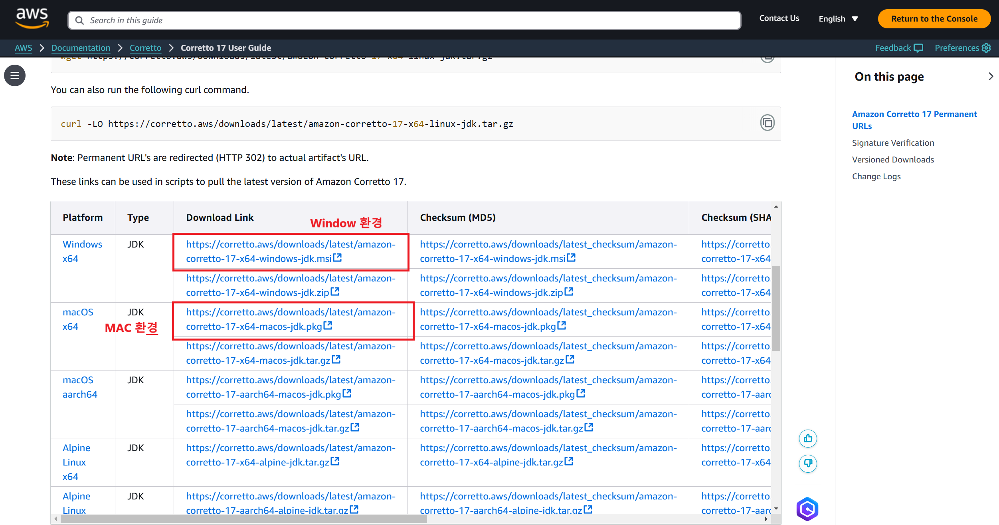
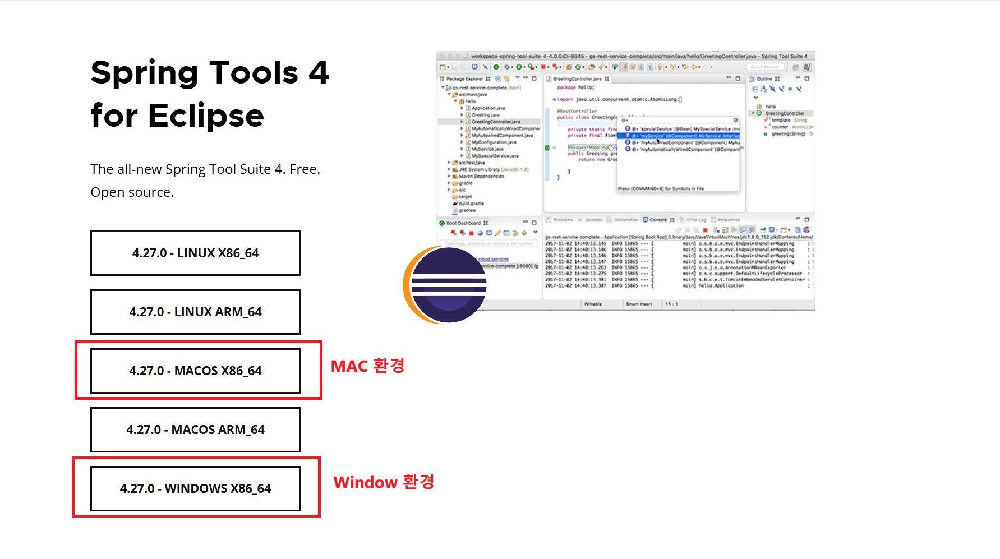
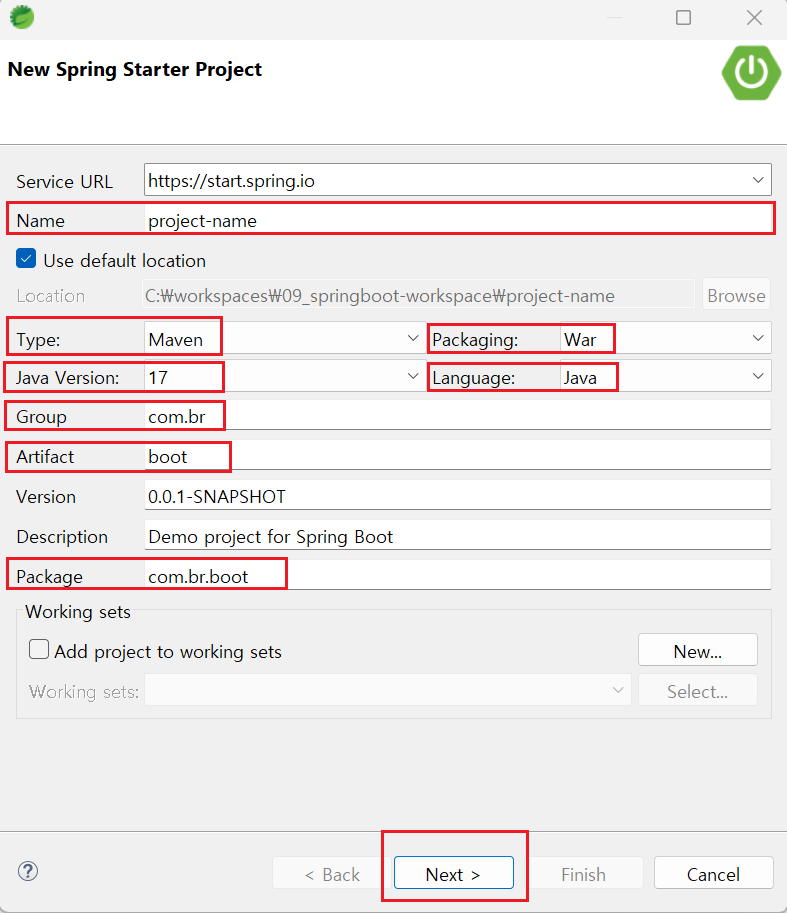
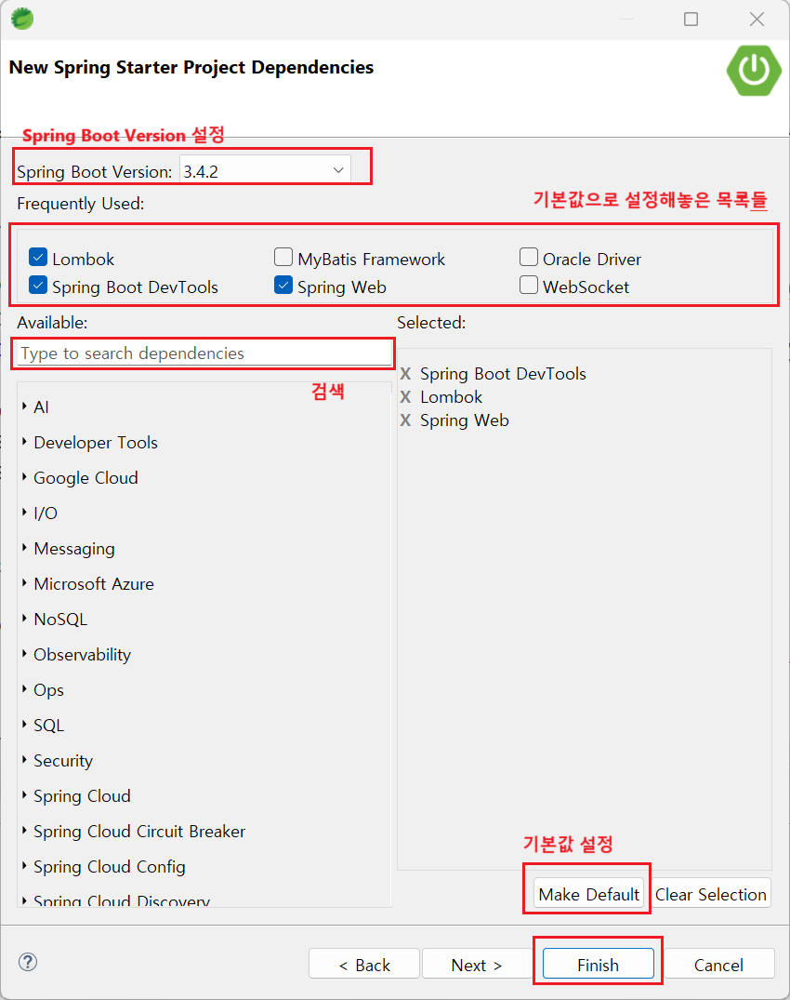

# Spring Boot

# 1. 설치 및 세팅

### 자바 설치 - OpenJDK 17

- #### 아래의 url 클릭한 후 다운로드

  https://docs.aws.amazon.com/corretto/latest/corretto-17-ug/downloads-list.html

  

<br>

- #### 경로 수정 필요 없이 계속 next 누르면서 설치하면 됨

- #### 자바 버전 확인 :

  ```bash
  java -version
  ```

### STS4 다운 및 설치

- #### STS 공식 사이트에서 설치 파일 다운로드

  https://spring.io/tools

  

  > - 운영체제에 맞는 버튼을 누르면 다운로드가 진행되며 `spring-tool-suite-4-4.22.1.RELEASE-e4.32.0-win32.win32.x86_64.self-extracting.jar` 이름의 파일이 다운로드된다(버전 이름은 다를 수 있음).
  > - 버전은 자주 업데이트 되므로 첫번째인 **메인 버전**과 중간의 **미들버전**만 중요하게 보면 됨

- #### 다운 받은 파일 압축 풀기

  - 파일 더블클릭하면 압축이 풀리면서 `sts-4.22.1 RELEASE` 라는 폴더 생성됨
  - 압축 푼 폴더 C드라이브 내로 이동

- #### workspace 생성

  - `workspaces` 폴더 안에 `09_springboot-workspace` 폴더 생성

<br><br>

### STS 환경 설정(workspace 세팅 : Window -> Preference 탭)

- `C:\workspaces/09_springboot-workspace` 경로로 STS4 실행
- Show View의 탭은 `Package Explorer`, `Boot Dashboard`(Server 역할), `Problems` 탭 빼고 다 없애도 됨
- - Window -> Show view 에서 `console` 탭 추가

#### 1. Encoding 설정

**1단계 : `Eclipse Marketplace` 에서 `Eclipse Enterprize Java and Web Developer Tools` 설치**

> - STS4에서는 기본적으로 프론트 관련 파일(에디터)을 지원하지 않기 때문에 초반에 Preference 탭에서 Encoding을 검색해도 목록에 `General>workspace` 만 있음
> - `JSP`, `HTML`, `CSS`, `JavaScript`, `XML` 관련 내용을 STS4에서 이용하고자 한다면 별도로 Marketplace에서 설치해줘야 함!

- Help > Eclipse Marketplace 열기 (Windows Defender Exclusion Check 창이 뜬다면 일단 cancel 눌러주면 됨)
- **설치 방법** :

  (1) `Eclipse Enterprize Java and Web Developer Tools` 설치 <br>
  (2) 기본적으로 체크되어 있는 항목 그대로 두고 confirm 누름 <br>
  (3) 동의 약관에서는 `I accept` 누르고 `finish` 클릭 <br>
  (4) 설치 중에 `Trust Artifacts` 창이 뜨면 `Select All` 누르고 `Trust Select` 클릭 <br>
  (5) Restart 창이 뜨면 `Restart Now` 버튼 클릭 <br>
  (6) 재부팅 후 `Window Defender` 창(방화벽 관련)이 뜨면 첫번째 항목 선택 후 `Proceed` 버튼 클릭 후 예 클릭

- **설치 확인** : `File > New > Other ` 탭에서 `html`, `css`, `xml`, `jsp` 각각 검색 후 해당 목록 나오면 성공

<br>

**2단계 : Preference에서 UTF-8로 Encoding 설정**

- `Encoding` 검색 후 설정 :
  - `General > workspace`
  - `Web > CSS Files / HTML Files / JSP Files`
  - `XML > XML Files`
- `spelling` 검색 후 설정 : `General > Editors > Text Editors > Spelling`
- `json` 검색 후 설정 : `JSON > JSON Files`

#### 2. Template, 탭 단위 설정

- `Java > Code Template` 에서 Code의 **Method body**, **Catch block body** 의 주석 지우기
- `General > Editors > Text Editors` 에서 **Diaplayed tab width : 2**로 변경

#### 3. JSP Template 설정

- `Web > JSP Files > Editor > Templates` (jsp templates 검색)
- **New JSP File (html 5)** 더블 클릭해서 커스터마이징
  - 패턴 추가
    ```jsp
    <%@ taglib prefix="c" uri="http://java.sun.com/jsp/jstl/core" %>
    <c:set var="contextPath" value="$${pageContext.request.contextPath}" />
    ```
    > `$`를 문자로 표현하려면 `$`를 두번 써야함

#### 4. XML Catalog 등록

- migration 실습이기 때문에 지금은 생략(새로운 mybatis용 xml 파일 생성할 일이 없음)
- mybatis용 mapper파일을 만들 일이 있다면 그때 설정을 해둬야 한다

#### 5. Server 세팅

- 서버 세팅은 안해도 됨
- 내장 톰캣(10버전)을 기본적으로 가지고 있기 때문

#### 추가 : New 의 목록도 커스터마이징 가능

- `Window > Perspective > Customize Perspective` 에서 설정 가능
  (31분 44초 까지 봄)

### 실습 : 간단한 Boot 프로젝트 새로 생성하기

#### 1. `Package Explorer` → 마우스 우클릭 → `New` → `Spring Starter Project` 선택

  

- Name : 프로젝트명
- Type : 빌드 프로그램 설정 (Maven으로 설정)
- Package : 배포 시 내보낼 확장자명 설정(War로 설정)
- Java version : 자바 버전 설정
- Group : 보통 두번째 레벨까지는 조직이나 회사 도메인의 역순으로 적은 형태로 설정
- Artifact : 프로젝트의 이름, 프로젝트의 고유한 이름 사용 → 빌드 후 생성된 아티팩트(보통 jar파일)의 이름에 영향을 미침
- Package : Group과 Artifact를 조합해서 작성

#### 2. Spring Boot 버전 및 dependency 설정 후 Finish

  

- Spring Boot 버전 : SNAPSHOT이 붙어있지 않은 것이 안정화된 버전 → 실습에서는 `3.2.5` 버전 선택
- dependency 설정
  - 필요한 dependency만 추가하기 (나중에 기능 구현하면서 필요한 dependency 추가 가능함)
  - `Spring Boot DevTools`, `Lombok`, `Spring Web` dependency 추가
  - Make Default : 추가된 목록을 기본값으로 설정 → 나중에 선택지가 상단(`Frequently Used` 탭)에 나타남
- `Finish` 버튼 누르면 프로젝트 생성됨

#### 3. 생성된 프로젝트의 구조

- `src/main/java` : 이곳에서 작업
  - 설정해놓은 `Pakage`가 있음 (ex: `com.br.boot`)
  - `Servletinitializer.java`, `SpringBootProjectApplication.java` 이 두개의 파일은 절대 삭제하면 안됨!!
- `src/main/resource`
  - `static` : 정적인 자원 보관 (Legacy Project에서 `src/main/webapp/resources` 폴더와 같은 역할)
  - `templates` : `Thymeleaf` 같은 템플릿 엔진을 사용하여 동적 웹페이지를 생성할 때 사용됨, 정적인 HTML 파일 보관 → `Thymeleaf`를 사용하지 않기에 사용할 일 없음
  - `application.properties` :
    - 매우 중요한 파일
    - 환경 설정과 관련된 내용을 여기에 모두 작성
- `src/main/webapp` :

  - 일반 폴더
  - 기존 legacy 프로젝트에서 기본적으로 만들어졌던 `WEB-INF`나 `WEB-INF/views`, `WEB-INF/spring` 폴더는 이곳에서는 만들어지지 않음 → 필요한 폴더는 직접 만들어야함

- 서버는 `Boot Dashboard` 탭에 `Local` 안에 자동으로 생성된 프로젝트가 올라와있음
  - 내장 톰캣은 10버전이기 때문에 서버 관련된 class들은 `jakarta` 패키지에서 제공함 (ex: `HttpSession`,`HttpServletRequest`, `HttpServletResponse` 등)
    - 기존 Legacy 프로젝트 migration 시 import문 수정 필수
    - 기존 Legacy 프로젝트에선 외장 톰캣 9버전을 사용했기 때문에 자동으로 `javax` 패키지에서 제공되는 것으로 설정됨
- `pom.xml` 파일 : 프로젝트 설정 관련 내용

58분 36초

<br>

---

<br>

## 2. jsp 작업을 위한 세팅

<br>

---

<br>

## 3. 리소스 핸들링 작업

<br>

---

<br>

# 2. Migration 작업

## 1. BCryptPassword 작업

<br>

---

<br>

## 2. MyBatis, Logback, log4jdbc 작업

<br>

---

<br>

## 3. 파일 업로드 작업

<br>

---

<br>

## 4. Interceptor 작업

<br>

---

<br>

## 5. Scheduler 작업

<br>

---

<br>

## 6. WebSocket 작업

<br>

---

<br>

- ### 정리

| 구분      | Spring Legacy(MVC) Project (Spring) | Spring Boot(Starter) Project (Spring Boot) |
| --------- | ----------------------------------- | ------------------------------------------ |
| Java 버전 | 11                                  | 17                                         |
| IDE       | STS3 (3.9.17.RELEASE)               | STS4 (4.22.0.RELEASE)                      |
